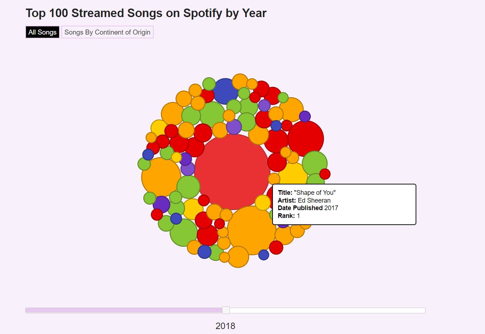
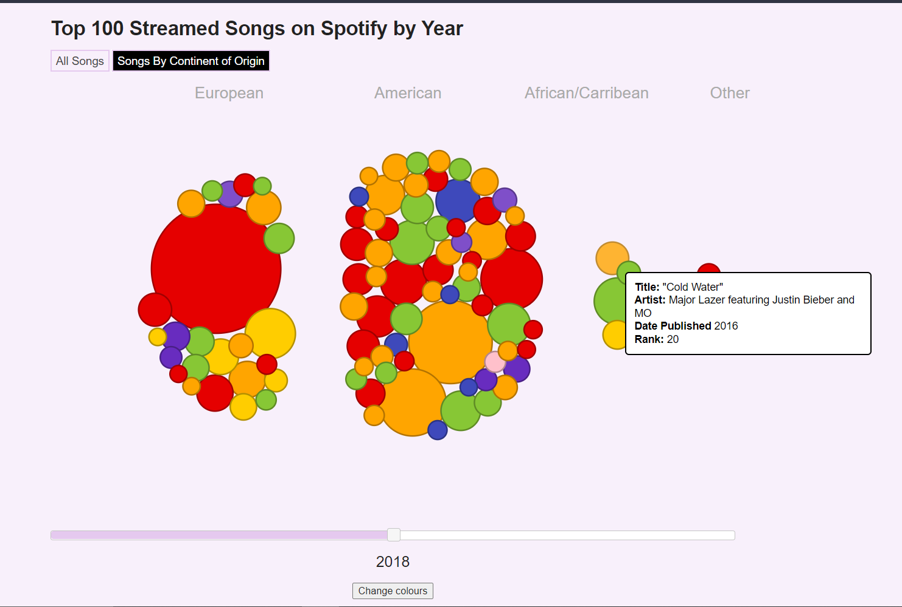

# D3 Bubble Chart

Use a bubble chart to visualise data

## Getting Started

These instructions will get you a copy of the project up and running on your local machine for development purposes.

### Prerequisites

Ensure that you have internet connection as the code requires some data from non-local repositories

Ensure that you have the latest version of node installed onto machine

Ensure that you have localhost port 8080 free; close programs like Skype/XAMPP

Ensure that you have a web browser such as Chrome, Brave Browser or Firefox

Enter this command into your terminal, ensure that you have this version of node installed
```
node --version

v12.14.10
```

If you see an error, the latest version of node can be installed from :

[Node.js installation page](https://nodejs.org/en/download/)

### Installing

1. Open git bash/cmd in the directory where you have the files installed
2. In your html file make sure that you have a "div" container with the id "#vis"; this is where the visualisation will be drawn into
```
<div id="vis">
	
</div>
```
2. Import your data onto the webpage either with d3 or other ajax request; you could also choose to pass a raw data object to the BubbleChart constructor
3. In your javascipt file write the following code
```
let nameOfBubbleChart = new BubbleChart(data);
```
If you are using d3 remember to initalise the BubbleChart object within the callback function/ promise
```
d3.csv("path\to\csv", function(data){
	let nameOfBubbleChart = new BubbleChart(data);
});
```
Or you could pass raw data into bubbleChart
```
let nameOfBubblChart = new BubbleChart({"some_field":1234
"other_field": 456,
"foo_field", True	
});
```
4. run command 'npm start' (Ignore the module not found error)
5. View your visualislation at "localhost:8080/main" in your browser (Chrome, Firefox, Brave)

```
C:\Program Files\D3\> npm start
```

## Built With

* [D3](https://github.com/d3/d3/wiki) - The web framework used
* [jQuery](https://api.jquery.com/) - Another web framework used
* [Wikipedia](https://www.wikipedia.org/) - Used to obtain a dataset


## Authors

* **Jim Vallandingham** - *Initial work* - [GitHub repo for initial work](https://github.com/vlandham/bubble_chart)

* **Jeffrey Kola-Abodunde** - *Current work*

## License

* This project is licensed under Creative Commons Attribution-ShareAlike 
* [Original Data](https://en.wikipedia.org/wiki/List_of_most-streamed_songs_on_Spotify) 
* --Also using pages in revision history:
* [December 30, 2017](https://en.wikipedia.org/w/index.php?title=List_of_most-streamed_songs_on_Spotify&oldid=817803296)
* [December 30, 2018](https://en.wikipedia.org/w/index.php?title=List_of_most-streamed_songs_on_Spotify&oldid=876064632)

## References

* Used a color generator mentioned by **Dimitry K** in the comment section of  [Paul Irish website](https://www.paulirish.com/2009/random-hex-color-code-snippets/)
* Insipration from [Obama Budget Proposal by New York Times](https://archive.nytimes.com/www.nytimes.com/interactive/2012/02/13/us/politics/2013-budget-proposal-graphic.html)

# Images
Example 1

Example 2


